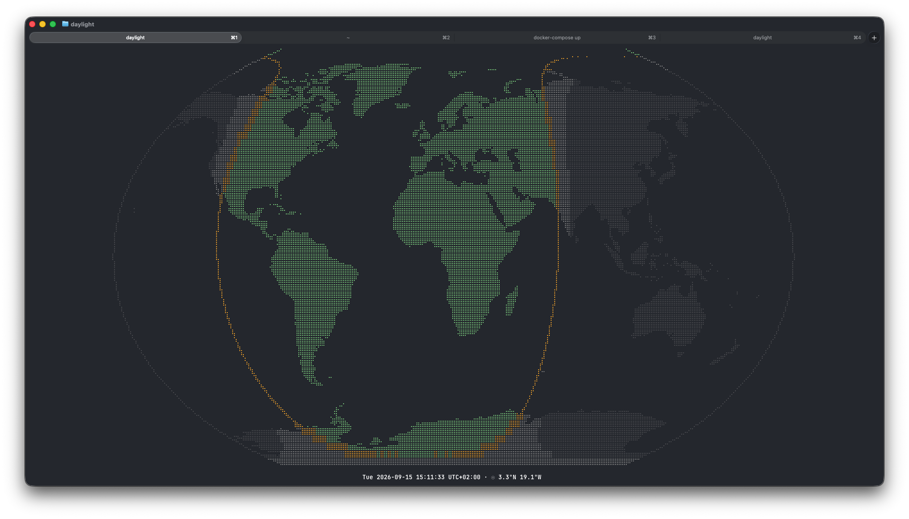

# daylight

A terminal day/night world clock: an ASCII/Unicode world map in the **Kavrayskiy VII**
projection, shaded by real-time **daylight** (terminator + optional civil twilight),
rendered with **8-dot braille characters** for sub-character-cell resolution, with the
current date and time in your timezone.

    git clone … && cd daylight
    cargo run

[](docs/screenshot.png)

## Installation

Requires a Rust toolchain (1.74+). Build and install the release binary:

```sh
cargo install --path .
```

or just run it in place:

```sh
cargo run --release
```

No network access, config files, or external data are needed at runtime — the
Natural Earth 1:110m coastline data (public domain) is embedded in the binary
(~18 KB encoded).

## Usage

Run `daylight` in a terminal. `daylight --help`:

```
Terminal day/night world clock: Kavrayskiy VII map, real-time terminator, braille rendering

Usage: daylight [OPTIONS]

Options:
      --center <DEG>
          Central meridian, degrees east [-180..180]. Takes precedence over `--utc` for the map meridian (the clock stays UTC).
          
          Default: 15° × UTC offset of the local timezone captured at startup, so your longitude sits near the map center.

      --utc
          Clock in UTC; central meridian 0°

      --twilight
          Also draw the civil twilight (−6°) curve

      --no-outline
          Do not draw the one-dot outline around the map oval

      --no-rotate
          Do not slowly rotate the map (one full turn in ~6 minutes)

      --interval <MS>
          Redraw interval in milliseconds while rotating [10..1000]
          
          [default: 100]

      --ascii
          Render without braille ('#' land, '.' terminator) for limited fonts

      --color <COLOR>
          When to use color: auto | always | never
          
          [default: auto]
          [possible values: auto, always, never]

      --once
          Render one frame to stdout and exit (implied when stdout is not a TTY)

  -h, --help
          Print help (see a summary with '-h')

  -V, --version
          Print version

Interactive keys (letter keys are case-insensitive):
  q, Esc, Ctrl-C    quit (Ctrl-C exits 130)
  Ctrl-Z            suspend (restore on resume)
  u                 toggle UTC/local clock
  c                 re-center map to current timezone
  t                 toggle twilight curve
  o                 toggle map-oval outline
  a                 toggle slow rotation
  r                 force repaint

The clock runs in the timezone current at startup (or UTC with --utc); only the
map center is pinned at startup — press c to re-center live.
```

### Interactive keys

All letter keys accept uppercase too.

| Key | Action |
| --- | --- |
| `q`, `Esc` | quit |
| `Ctrl-C` | quit (exit code 130) |
| `Ctrl-\` | quit (exit code 131; terminal restored) |
| `Ctrl-Z` | suspend; the terminal is restored and repainted on resume |
| `u` | toggle UTC/local clock |
| `c` | re-center the map to the current timezone |
| `t` | toggle the civil twilight curve |
| `o` | toggle the map-oval outline |
| `a` | toggle slow rotation |
| `r` | force repaint |

### Examples

```sh
daylight                  # interactive; centered on your timezone
daylight --utc            # UTC clock, Greenwich-centered map
daylight --center 90      # map centered on 90°E
daylight --center -120    # negative values work too
daylight --twilight       # also draw the −6° twilight curve
daylight --no-outline     # no map-oval outline
daylight --no-rotate      # static map instead of slow rotation
daylight --ascii          # '#'/'.' glyphs instead of braille
daylight --once > map.txt # one static frame (also automatic when piping)
```

## Behavior notes

- The clock runs in the timezone current at startup; DST transitions while running
  are still shown correctly. Only the map's central meridian is pinned at startup —
  press `c` to re-center live. By default the map slowly rotates eastward
  (one full turn in ~6 minutes; `--no-rotate` or `a` to stop), redrawing
  every 100 ms for a fluid motion (tune with `--interval`).
- Honors `NO_COLOR` and `TERM=dumb`; degrades to dim/bold attributes without color.
  Color output uses only the 16 standard ANSI colors, so your terminal theme's
  palette is respected on every computer.
- Well-mannered terminal citizen: alternate screen, symmetric raw-mode
  setup/teardown (also on panics and signals), no bell, no mouse capture, scrollback
  untouched. Exit codes: 0 clean, 2 usage error, 1 runtime error (including stdout
  write failures), 130/143/129/131 for INT/TERM/HUP/QUIT.
- Lean: while idle (rotation off) the process is blocked on terminal input (~0% CPU);
  while rotating it redraws every 100 ms. Frames are diffed and only changed cells
  are written; the land polygons are preprocessed once at startup.

## Development

```sh
cargo test                          # unit + CLI self-spawn + PTY integration tests
cargo fmt --check
cargo clippy --all-targets -- -D warnings
```

Map data can be regenerated from `data/ne_110m_land.geojson`:

```sh
cargo run --example datagen -- data/ne_110m_land.geojson
```

See [PLAN.md](PLAN.md) — the original design plan, decision records, and risk
log (kept as a historical record) — and [CHANGELOG.md](CHANGELOG.md) for
changes over time. Linux/UNIX only.

## License

Copyright (C) 2026 Nirro

This program is free software: you can redistribute it and/or modify it under
the terms of the GNU Affero General Public License as published by the Free
Software Foundation, either version 3 of the License, or (at your option) any
later version.

This program is distributed in the hope that it will be useful, but WITHOUT ANY
WARRANTY; without even the implied warranty of MERCHANTABILITY or FITNESS FOR A
PARTICULAR PURPOSE. See the [LICENSE](LICENSE) file for the full license text.
